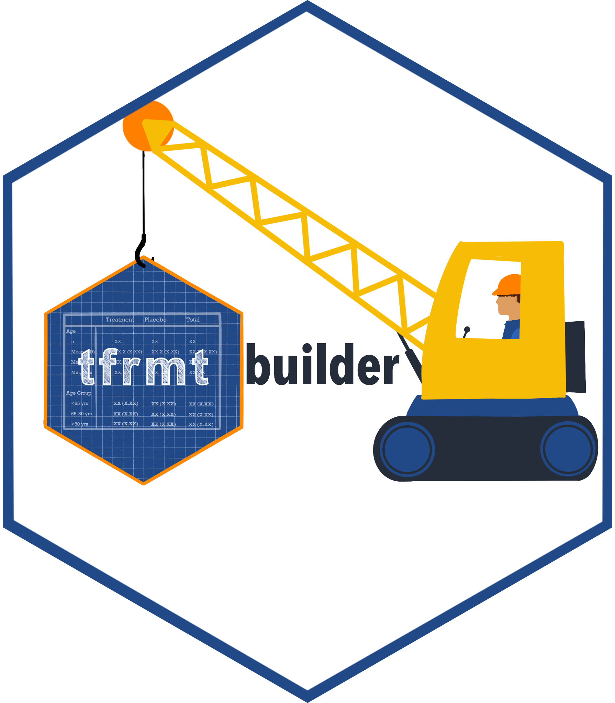

# {tfrmtbuilder}<a href='https://gsk-biostatistics.github.io/tfrmtbuilder/'></a>


<!-- badges: start -->

[](https://github.com/GSK-Biostatistics/tfrmtbuilder/actions/workflows/R-CMD-check.yaml)
[](https://github.com/GIScience/badges#experimental)
[](https://CRAN.R-project.org/package=tfrmtbuilder)
<!-- badges: end -->

The {tfrmt} package provides a language for defining display-related metadata, which can then be used to automate and easily update output formats. {tfrmtbuilder} serves as an interface to the package, allowing users to quickly and easily modify existing or new table templates. 

## Supported workflows

Like {tfrmt}, {tfrmtbuilder} can be used to support a variety of workflows, including the following:

- Creating tables from scratch
- Create tables based on a template
- Modifying an existing table

Additionally, {tfrmtbuilder} supports tables created during study planning (mock tables) or later on after the analysis is complete. 

## App Features and Workflow

- Mock vs. non-mock toggle
  - At the top of the app, use the toggle to specify whether you are generating a mock (no data values) or a table with data values.

- Initialize tab
  - Load an existing {tfrmt} (JSON) or start fresh 
  - Define your data source:
    - Auto [mock only]: Use auto-generated mock data
    - Upload: Upload an existing dataset (most file formats)
      - Note: If in 'mock' mode, this will serve as a shell with the numeric data value column ignored
    - Example [mock only]: Use a pre-loaded example dataset 

- Edit tab
  - Select ARD column mappings
  - Format table via the 'plans' and other functionality 
  - View the table as you modify
  
- Export tab
  - Download {tfrmt} metadata (JSON) 
  - Download {tfrmt} table (HTML, PNG) 
  
## Usage

{tfrmtbuilder} can be installed and used with the following code:

```r
# development version
devtools::install_github("GSK-Biostatistics/tfrmtbuilder")

# from CRAN
install.packages("tfrmtbuilder")

# Load app
library(tfrmtbuilder)
tfrmtbuilder()
```

### Useful Links 

- [Example app](https://bzkrouse.shinyapps.io/tfrmtbuilder/)
- [{tfrmt} User Guide](https://gsk-biostatistics.github.io/tfrmt/)
- [{tfrmt} GitHub Repository](https://github.com/GSK-Biostatistics/tfrmt)

